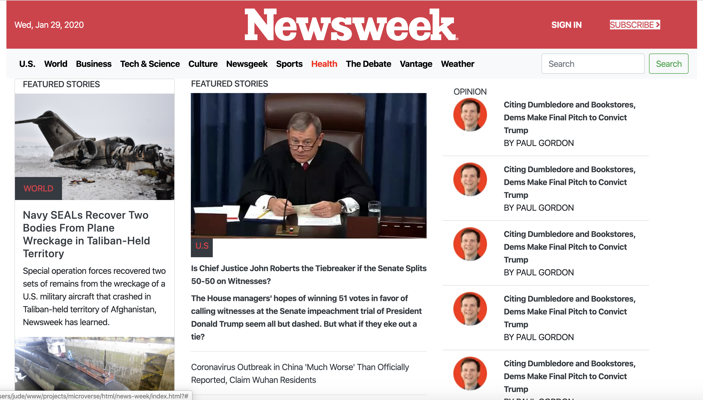

# News Week

This project is meant to help the candidadate to be introduced to bootstrap and get a deeper understanding of responsive design and the different ways this can be achieved with bootstrap. The clone of the newsweek is what we used.

## Built With

- HTML5
- CSS3
- Bootstrap

## Live Demo

[Live Demo Link](https://raw.githack.com/kbjude/news-week/ft-index/index.html)

###  Prerequisites
  - Have any browser that supports HTML5 and CSS#
### Install
  - With the browser set, you do not need to install any other thing
  - Clone the files to your local drive.
### . Usage
  - Open the index.html file and you are good to go.
## Authors
  - 
👤 Jude Kajura

- Github: [@kbjude](https://github.com/kbjude)

## 🤝 Contributing

Contributions, issues and feature requests are welcome!

Feel free to check the [issues page](https://github.com/kbjude/news-week/issues).

## Show your support

Give a ⭐️ if you like this project!

## 📝 License

This project is [MIT](lic.url) licensed.
